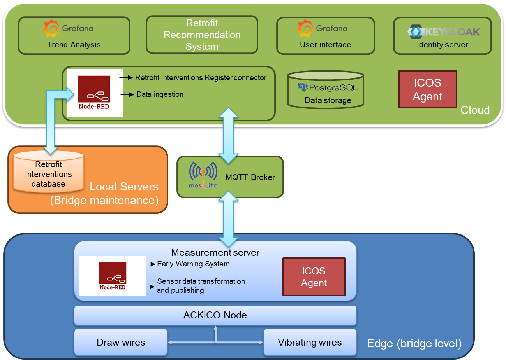

# SHMart4bridge
 

This repository contains the SHMart4bridge solution for ICOS project. The solution enables infrastructure health monitoring.


# Overview
As illustrated in the following diagram the solution has two main parts. The edge part called measurement server and cloud. The measurement server consists of node-red and appropriate flows for intercepting measurements from ACKICO nodes using a file watcher and raising alarms when measurements exceed predefined limits.

The cloud part handles data ingestion and storage using node-red and PostgreSQL. Data visualization and analysis using Grafana. Authentication and authorization using Keycloak. And communication with a private MySQL database for ingesting infrastructure retrofit records.



The repository is grouped in three parts one for the measurement server, one for the cloud, and ones for files related to ICOS integration.

For the measurement server and for the cloud Docker compose files are provided that setup the environment. Along with the appropriate node-red flows and Grafana dashboards.


## Requirements

Docker and Docker Compose.

## Build and run
Building and running with Docker Compose. In the respective directories execute the following commands:

```
docker compose up -d --build
```

## Configuration

The first step is to configure Keycloak. Please refer to the documentation at https://www.keycloak.org/archive/documentation-24.0.html. Also refer to Grafana documentation for Keycloack configuration: https://grafana.com/docs/grafana/latest/setup-grafana/configure-security/configure-authentication/keycloak/.

Next you may import the workflows in the node-red instances. The JSON files provided can be imported as is.

Lastly, import the Dashboard in Grafana. Again the JSON files provided can be imported as is. make sure to use a user with Administrator or Editor rights.


# Legal
The SHMart4bridge solution is released under the Apache 2.0 license.
Copyright © 2024-2025 SolutiONN. All rights reserved.
